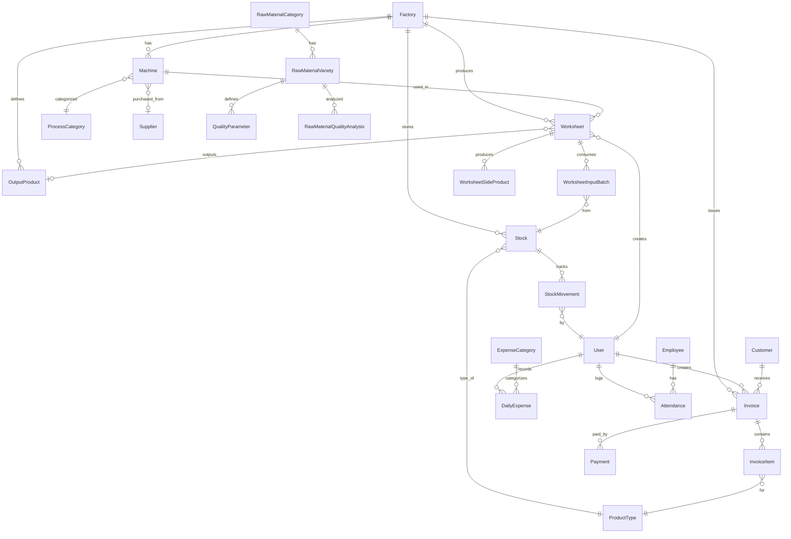

# Data Map & Entity Relationships
## ERP Pangan Masa Depan

Dokumen ini menjelaskan struktur data dan relasi antar entitas dalam sistem ERP.

---

## 📊 Overview

Sistem terdiri dari **25 entitas database** yang saling terhubung untuk mengelola:
- **Produksi** - Worksheet, Stock, Machine, Process
- **Penjualan** - Invoice, Customer, Payment
- **Keuangan** - DailyExpense, ExpenseCategory
- **HRD** - Employee, Attendance
- **Master Data** - Factory, Supplier, ProductType, RawMaterial

---

## 🗺️ Entity Relationship Diagram



---

## 📋 Daftar Entitas

### 🏭 Modul Produksi

| Entity | Deskripsi | Relasi Utama |
|--------|-----------|--------------|
| **Factory** | Pabrik (PMD 1, PMD 2) | → Machine, Stock, Worksheet, Invoice |
| **Machine** | Mesin produksi | → Factory, ProcessCategory, Supplier |
| **ProcessCategory** | Kategori proses (Drying, Husking, dll) | → Machine |
| **OutputProduct** | Produk output per pabrik | → Factory, Worksheet |
| **Worksheet** | Lembar kerja produksi | → Factory, User, Machine, OutputProduct |
| **WorksheetInputBatch** | Batch input material | → Worksheet, Stock |
| **WorksheetSideProduct** | Produk samping (bekatul, sekam) | → Worksheet |

### 📦 Modul Inventory

| Entity | Deskripsi | Relasi Utama |
|--------|-----------|--------------|
| **Stock** | Stok produk per pabrik | → Factory, ProductType |
| **StockMovement** | Riwayat pergerakan stok | → Stock, User |
| **ProductType** | Jenis produk (GKP, Beras, dll) | → Stock, InvoiceItem |

### 🌾 Modul Bahan Baku

| Entity | Deskripsi | Relasi Utama |
|--------|-----------|--------------|
| **Supplier** | Data supplier | → Machine (vendor) |
| **RawMaterialCategory** | Kategori bahan baku | → RawMaterialVariety |
| **RawMaterialVariety** | Varietas bahan (Ciherang, IR64) | → RawMaterialCategory, QualityParameter |
| **QualityParameter** | Parameter kualitas (Moisture, Density) | → RawMaterialVariety |
| **RawMaterialQualityAnalysis** | Hasil analisis kualitas | → RawMaterialVariety, StockMovement |

### 💰 Modul Sales

| Entity | Deskripsi | Relasi Utama |
|--------|-----------|--------------|
| **Customer** | Data pelanggan | → Invoice |
| **Invoice** | Invoice penjualan | → Factory, Customer, User |
| **InvoiceItem** | Detail item invoice | → Invoice, ProductType |
| **Payment** | Pembayaran invoice | → Invoice, User |

### 💳 Modul Finance

| Entity | Deskripsi | Relasi Utama |
|--------|-----------|--------------|
| **ExpenseCategory** | Kategori pengeluaran | → DailyExpense |
| **DailyExpense** | Pengeluaran harian | → Factory, ExpenseCategory, User |

### 👥 Modul HRD

| Entity | Deskripsi | Relasi Utama |
|--------|-----------|--------------|
| **Employee** | Data karyawan | → Attendance |
| **Attendance** | Kehadiran karyawan | → Employee, User |

### 🔐 Core

| Entity | Deskripsi | Relasi Utama |
|--------|-----------|--------------|
| **User** | User sistem | → Worksheet, Invoice, DailyExpense, etc |

---

## 🔄 Alur Data Utama

### 1. Alur Produksi (Production Flow)
```
Supplier → RawMaterial → Stock (Input) 
    → Worksheet (Process) → Stock (Output) + SideProducts
```

### 2. Alur Penjualan (Sales Flow)
```
Stock (Available) → InvoiceItem → Invoice → Payment
    → StockMovement (Reduce)
```

### 3. Alur Kualitas (Quality Flow)
```
RawMaterialVariety → QualityParameter (Standards)
    → RawMaterialQualityAnalysis (Actual) → Grade Assignment
```

---

## 📌 Catatan Teknis

### Foreign Key Patterns
- `id_factory` - Referensi ke Factory
- `id_user` - Referensi ke User (created/modified by)
- `id_*` - Foreign key pattern umum
- `otm_*` - TypeORM relation object

### Enum Types
- `InvoiceStatus`: DRAFT, SENT, PAID, CANCELLED
- `MachineStatus`: ACTIVE, MAINTENANCE, INACTIVE
- `WorkshiftType`: PAGI, SIANG, MALAM

---

*Terakhir diperbarui: 26 Januari 2026*
